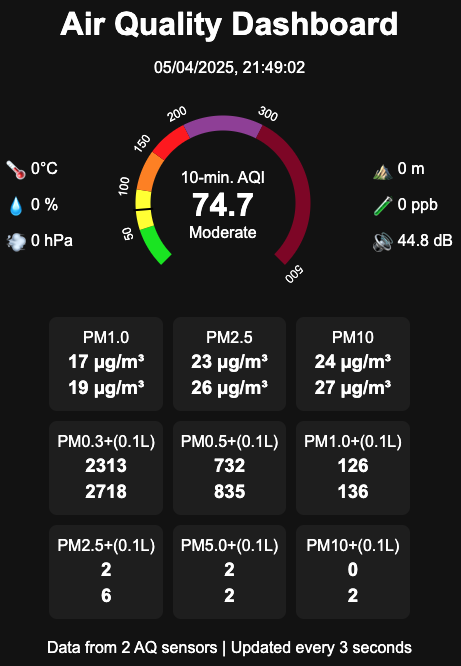
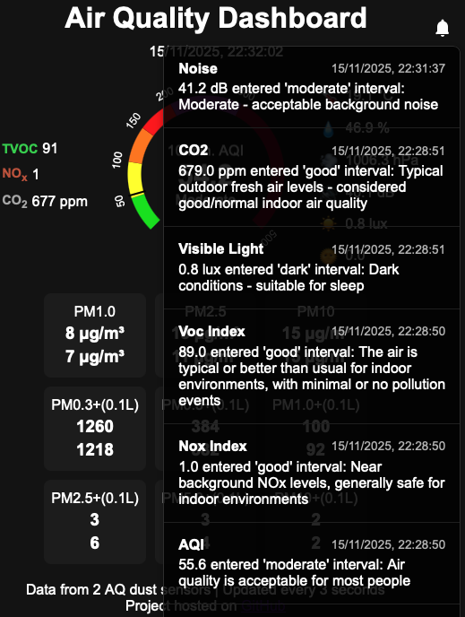

# Air Quality Monitoring Kit

The software component of the kit is a web server based on FastAPI Python package for displaying in real time the Air Quality Index (AQI),
as well as the particle concentration for different particle diameters. Other air pollutants (Total Volatile Organic Compounds, Nitrate Oxides, Carbon Dioxide, etc) and
environmental parameters (Temperature, Pressure, Relative Humidity, Noise Level, etc) are also shown. The data is delivered over websockets periodically to the web page.

The hardware component relies on a Raspberry Pi as the main processing unit and is designed such that sensors can be easily added, replaced or removed.

## Prerequisites

- Debian 12

- An InfluxDB 3 Core database is used to store the data received from different sensors and retrieved it to be shown in a web page.
The following databases must be configured: dust, gas, climate, sound, light. A read/write access token must be configured.

- A Python virtual environment must be setup in order to run the Python scripts:

```bash
    python3 -m venv .venv
    source .venv/bin/activate
    pip install -r requirements.txt
```

## Setup Influxdb3 database

- Show database service status

```bash
sudo systemctl status influxdb3-core
```

- Show database service logs

```bash
sudo journalctl -fu influxdb3-core
```

- Quick fix in case the service does not start

```bash
sudo rm -rf ~/.influxdb/data/airquality/wal
sudo rm -f ~/.influxdb/data/airquality/snapshots/*
```

- Create database

```bash
  export INFLUXDB3_AUTH_TOKEN="<token>"
  influxdb3 create database <name>
```

- Show available databases:

```bash
  export INFLUXDB3_AUTH_TOKEN="<token>"
  influxdb3 show databases
```

## Get Sensor Data

Several Python scripts must be started to read data from sensors and write the data into the database:

  - `air_quality.py`: Reads the particle concentration data from two PMSA003 air quality dust sensors, computes the 10 min AQI and writes it to the aqi and pm databases. The USB ports where the air quality sensors are attached must be provided as inputs.

```bash
    export INFLUXDB3_AUTH_TOKEN="<token>"
    ./air_quality.py /dev/ttyUSB1 /dev/ttyUSB2
```

  - `noise_level.py`: Reads the noise level from a 2-Mic array sensor and writes it to the noise database. The USB port where the noise sensor is attached must be provided as input.

```bash
    export INFLUXDB3_AUTH_TOKEN="<token>"
    ./noise_level.py --port /dev/ttyACM0
```

  - `ambient.py`: Reads the temperature, the humididy, the pressure, the gas resistance and the indoor air quality and writes it to the database. In order to read this sensor and process raw data with BSEC library the user must install this [Python extension for BME68x](https://github.com/cristeab/bme68x-python-library).

```bash
    export INFLUXDB3_AUTH_TOKEN="<token>"
    ./ambient.py
```

- `light_sensor.py`: Reads the visible light in lux and the UV index from an LTR390 sensor.

```bash
    export INFLUXDB3_AUTH_TOKEN="<token>"
    ./light_sensor.py
```

- `carbon_dioxide_sensor.py`: Reads the CO2 level in ppm from an SCD41 sensor.

```bash
    export INFLUXDB3_AUTH_TOKEN="<token>"
    ./carbon_dioxide_sensor.py
```

The scripts print in the standard output the current data read from the sensors and can be installed as services using the `services/manage_services.sh` script.
When installing the Python scripts as services, one must provide in a separate file `/etc/default/aq_dashboard.env` the database access token.
Also, in order to automatically restart the services if an error occurs, the user running the services must have rights to run "sudo systemctl restart *.service" without requiring a password.
The datasets provided by these scripts can be analyzed with the [aq_data_analysis](https://github.com/cristeab/aq_data_analysis) project.

## Start the Web Server

Start the server with:

```bash
    export INFLUXDB3_AUTH_TOKEN="<token>"
    ./aq_dashboard.py
```

Access the server at: https://\<server URL\>:8888

<p align="center">
  
  
</p>

Left Column Values (Air Pollutants):

- Nitrate Dioxide (NO2) level

- Ozone (O3) level

- Carbon Monoxide (CO) level

- Total Volatile Organic Compounds (TVOC) index

- Nitrate Oxides (NOx) index

- Carbon Dioxide (CO2) level in PPM

Center Display:

- The timestamp expressed in local time zone of the most recent dust particle measurement

- The 10-minute Air Quality Index (AQI) - derived from dust particle measurements using a pair of PMSA007 sensors

Right Column Values (Environment Parameters):

-	Current room temperature in Celsius degrees

-	Relative humidity (amount of moisture in the air) - the normal value is around 40%

-	Atmospheric pressure expressed in hectoPascals

-	Noise level in the environment in decibels (30 dB would be very quiet)

- Visible light expressed in Lux

- UV index

Particulate Matter Measurements (from PMSA007 sensors):

-	PM1.0: Concentration of tiny particles smaller than 1.0 microns in diameter

-	PM2.5: Concentration of fine particles smaller than 2.5 microns - can penetrate deep into lungs. These values are used to compute the 10-min. AQI.

-	PM10: Concentration of particles smaller than 10 microns - includes dust, pollen, and mold

Particle Count Measurements (from PMSA007 sensors):

-	PM0.3+(0.1L): Number of particles larger than 0.3 microns per 0.1 liter of air

-	PM0.5+(0.1L) Number of particles larger than 0.5 microns per 0.1 liter of air

-	PM1.0+(0.1L) Number of particles larger than 1.0 microns per 0.1 liter of air

-	PM2.5+(0.1L): Number of particles larger than 2.5 microns per 0.1 liter of air

-	PM5.0+(0.1L) Number of particles larger than 5.0 microns per 0.1 liter of air

-	PM10+(0.1L) Number of particles larger than 10 microns per 0.1 liter of air

The notification list shown in the right image is sorted by timestamp in descending order and can be accessed by clicking the bell icon.

## Bill of Materials

| Quantity | Item |
|--------------|----------|
| **Processing Unit** | |
| 1            | Raspberry Pi 5, 4 GB RAM, 128 GB SSD |
| **Air Quality Dust Sensors** | |
| 2            | PLANTOWER PMSA003 Laser PM2.5 dust sensor |
| 2            | Adapter 4P G7A to G135 and 4pin 2.54mm conversion module G7 G10 G1 G3 G5 laser PM2.5 sensor exchange PLANTOWER |
| 2            | TZT FT232BL FT232RL Basic Breakout Board FTDI FT232 USB TO TTL 5V 3.3V Debugger Download Cable To Serial Adapter Module |
| **Noise Sensor** | |
| 1        | Seeed ReSpeaker Lite Kit-USB 2 Mic Array |
| **Temperature/Humidity/Pressure/Gas Sensor** | |
| 1        | BME688 Environment Sensor Module Temperature/Humidity/Pressure/Gas AI Smart I2C |
| **Light Sensor** | |
| 1        | LTR390 UV Light Sensor I2C |
| **CO2 Sensor** | |
| 1        | SCD41 I2C |
| **VOC and NOx Sensor** | |
| 1        | SGP41 I2C |

## Reference

https://cristeab.medium.com/building-an-air-quality-monitoring-station-ba74098f0528
