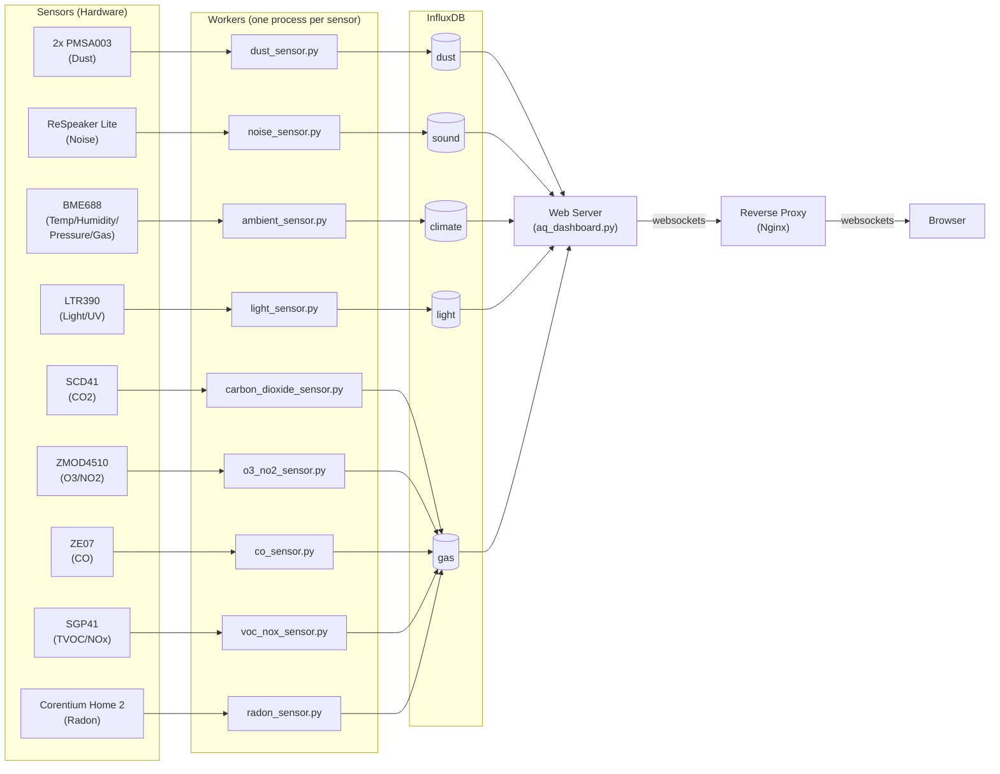
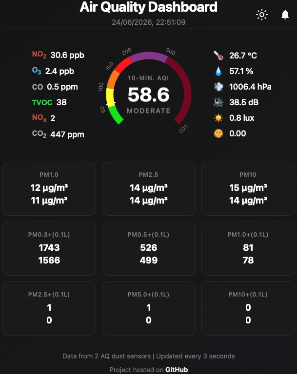
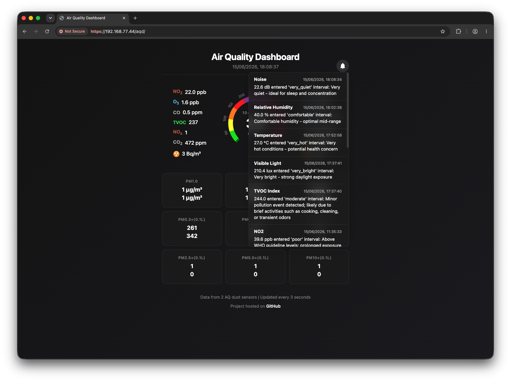

# Air Quality Monitoring Kit

## Introduction

The software component of the kit is a web server based on FastAPI Python package for displaying in real time the Air Quality Index (AQI),
as well as the particle concentration for different particle diameters. Other air pollutants (Total Volatile Organic Compounds, Nitrate Oxides, Carbon Dioxide, etc) and
environmental parameters (Temperature, Pressure, Relative Humidity, Noise Level, etc) are also shown. The data is read from different sensors and stored into a local database
before being delivered over websockets periodically to the web page shown in a web browser.

```mermaid
flowchart LR
    subgraph SENS["Sensors (Hardware)"]
        direction TB
        s1["2x PMSA003<br>(Dust)"]
        s2["ReSpeaker Lite<br>(Noise)"]
        s3["BME688<br>(Temp/Humidity/<br>Pressure/Gas)"]
        s4["LTR390<br>(Light/UV)"]
        s5["SCD41<br>(CO2)"]
        s6["ZMOD4510<br>(O3/NO2)"]
        s7["ZE07<br>(CO)"]
        s8["SGP41<br>(TVOC/NOx)"]
        s9["Corentium Home 2<br>(Radon)"]
    end

    subgraph WK["Workers (one process per sensor)"]
        direction TB
        w1[dust_sensor.py]
        w2[noise_sensor.py]
        w3[ambient_sensor.py]
        w4[light_sensor.py]
        w5[carbon_dioxide_sensor.py]
        w6[o3_no2_sensor.py]
        w7[co_sensor.py]
        w8[voc_nox_sensor.py]
        w9[radon_sensor.py]
    end

    subgraph DB["InfluxDB"]
      dustdb[("dust")]
      sounddb[("sound")]
      climatedb[("climate")]
      lightdb[("light")]
      gasdb[("gas")]
    end

    s1 --> w1
    s2 --> w2
    s3 --> w3
    s4 --> w4
    s5 --> w5
    s6 --> w6
    s7 --> w7
    s8 --> w8
    s9 --> w9

    w1 --> dustdb
    w2 --> sounddb
    w3 --> climatedb
    w4 --> lightdb
    w5 --> gasdb
    w6 --> gasdb
    w7 --> gasdb
    w8 --> gasdb
    w9 --> gasdb

    dustdb --> ws["Web Server<br>(aq_dashboard.py)"]
    sounddb --> ws
    climatedb --> ws
    lightdb --> ws
    gasdb --> ws

    ws -- websockets --> rp["Reverse Proxy<br>(Nginx)"]
    rp -- websockets --> bw[Browser]
```

The hardware component relies on a Raspberry Pi as the main processing unit and is designed such that sensors can be easily added, replaced or removed.

[Installation instructions](INSTALL.md)

## User Interface

  
  

Left Column Values (Air Pollutants):

- Nitrate Dioxide (NO2) concentration in PPB

- Ozone (O3) concentration in PPB

- Carbon Monoxide (CO) concentration in PPM

- Total Volatile Organic Compounds (TVOC) index

- Nitrate Oxides (NOx) index

- Carbon Dioxide (CO2) concentration in PPM

- Radon gas concentration in Bq/m3

Center Display:

- The timestamp expressed in local time zone of the most recent dust particle measurement

- The 10-minute Air Quality Index (AQI) - derived from dust particle measurements using a pair of PMSA007 sensors

Right Column Values (Environment Parameters):

-	Current room temperature in Celsius degrees

-	Relative humidity (amount of moisture in the air) - the normal value is around 40%

-	Atmospheric pressure expressed in hectoPascals

-	Noise level in the environment in decibels (below 20 dB would be very quiet)

- Visible light expressed in Lux

- UV index

Particulate Matter Measurements (from PMSA007 sensors):

-	PM1.0: Concentration of tiny particles smaller than 1.0 microns in diameter

-	PM2.5: Concentration of fine particles smaller than 2.5 microns - can penetrate deep into lungs. These values are used to compute the 10-min. AQI.

-	PM10: Concentration of particles smaller than 10 microns - includes dust, pollen, and mold

Particle Count Measurements (from PMSA007 sensors):

-	PM0.3+(0.1L): Number of particles larger than 0.3 microns per 0.1 liter of air

-	PM0.5+(0.1L) Number of particles larger than 0.5 microns per 0.1 liter of air

-	PM1.0+(0.1L) Number of particles larger than 1.0 microns per 0.1 liter of air

-	PM2.5+(0.1L): Number of particles larger than 2.5 microns per 0.1 liter of air

-	PM5.0+(0.1L) Number of particles larger than 5.0 microns per 0.1 liter of air

-	PM10+(0.1L) Number of particles larger than 10 microns per 0.1 liter of air

The notification list shown in the right image is sorted by timestamp in descending order and can be accessed by clicking the bell icon.

## Bill of Materials

| Type | Quantity | Comment |
|------|---------|----------|
| **Processing Unit** | 1 | Raspberry Pi 5, 4 GB RAM, 128 GB SSD |
| **Dust Sensor** | 2 | Plantower PMSA003 UART |
| **Noise Sensor** | 1 | Seeed ReSpeaker Lite Kit-USB 2 Mic Array |
| **Temperature/Humidity/Pressure/Gas Sensor** | 1 | Bosh BME688 I2C |
| **Light Sensor** | 1 | Lite-On LTR390 I2C |
| **CO2 Sensor** | 1 | Sensirion SCD41 I2C |
| **TVOC and NOx Sensor** | 1 | Sensirion SGP41 I2C |
| **O3 and NO2 Sensor** | 1 | Renesas ZMOD4510 I2C |
| **CO Sensor** | 1 | Winsen ZE07 CO UART |
| **Radon Sensor** | 1 | Airthings Corentium Home 2 BLE |

## Reference

https://cristeab.medium.com/building-an-air-quality-monitoring-station-ba74098f0528
