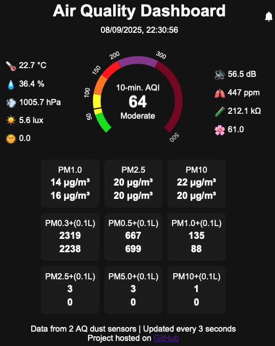

# aq_dashboard
Air Quality Dashboard

Web server based on FastAPI Python package. The data is delivered over websockets periodically to the web page.

Prepare Python virtual environment and activate it:

    python3 -m venv .venv
    source .venv/bin/activate

Install requirements with

    pip install -r requirements.txt

Start the server with:

    ./server.py

Access the server at: https://\<server URL\>:8888

