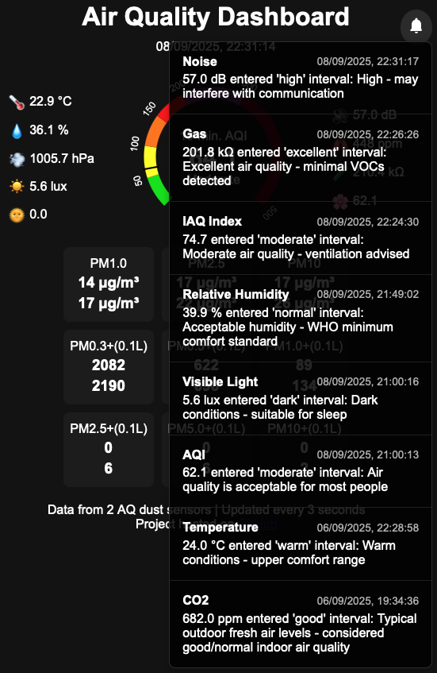

# Air Quality Dashboard

Web server based on FastAPI Python package for displaying in real time the Air Quality Index (AQI),
as well as the particle concentration for different particle diameters. The temperature, the humididy, the pressure, the noise level, the gas resistance and the indoor air quality are also shown. The data is delivered over websockets periodically to the web page.

## Prerequisites

- Debian 12

- An InfluxDB3 database is used to store the data received from different sensors and retrieved it to be shown in a web page.
The following databases must be configured: aqi, pm, noise, temperature, light. A read/write access token must be configured.

- A Python virtual environment must be setup in order to run the Python scripts:

```bash
    python3 -m venv .venv
    source .venv/bin/activate
    pip install -r requirements.txt
```

## Setup Influxdb3 database

- Show database service status

```bash
sudo systemctl status influxdb3-core
```

- Show database service logs

```bash
sudo journalctl -fu influxdb3-core
```

- Quick fix in case the service does not start

```bash
sudo rm -rf ~/.influxdb/data/airquality/wal
```

- Create database

```bash
  export INFLUXDB3_AUTH_TOKEN="<token>"
  influxdb3 create database <name>
```

- Show available databases:

```bash
  export INFLUXDB3_AUTH_TOKEN="<token>"
  influxdb3 show databases
```

## Get Sensor Data

Several Python scripts must be started to read data from sensors and write the data into the database:

  - `air_quality.py`: Reads the particle concentration data from two air quality dust sensors, computes the 10 min AQI and writes it to the aqi and pm databases. The USB ports where the air quality sensors are attached must be provided as inputs.

```bash
    export INFLUXDB3_AUTH_TOKEN="<token>"
    ./air_quality.py /dev/ttyUSB1 /dev/ttyUSB2
```

  - `noise_level.py`: Reads the noise level and writes it to the noise database. The USB port where the noise sensor is attached must be provided as input.

```bash
    export INFLUXDB3_AUTH_TOKEN="<token>"
    ./noise_level.py --port /dev/ttyACM0
```

  - `ambient.py`: Reads the temperature, the humididy, the pressure, the gas resistance and the indoor air quality and writes it to the temperature database. This script must be started as root. The USB port where the BME688 sensor is attached is automatically detected.

```bash
    export INFLUXDB3_AUTH_TOKEN="<token>"
    ./ambient.py
```

The scripts print in the standard output the current data read from the sensors.
The datasets provided by these scripts can be analysed with the [aq_data_analysis](https://github.com/cristeab/aq_data_analysis) project.

## Start the Web Server

Start the server with:

```bash
    export INFLUXDB3_AUTH_TOKEN="<token>"
    ./aq_dashboard.py
```

Access the server at: https://\<server URL\>:8888

<p align="center">
  
  
</p>

Left Column Values:

-	Current room temperature in Celsius degrees

-	Relative humidity (amount of moisture in the air) - the normal value is around 40%

-	Atmospheric pressure expressed in hectoPascals

Center Display:

- The timestamp expressed in local time zone of the most recent dust particle measurement

- The 10-minute Air Quality Index (AQI) - derived from dust particle measurements using a pair of PMSA007 sensors

Right Column Values:

-	Noise level in the environment in decibels (30 dB would be very quiet)

-	Gas resistance measurement in kilo ohms from the BME688 sensor - used to detect volatile compounds and gases (higher values mean less volatile compounds)

-	Indoor Air Quality index (smell index) calculated using gas resistance and humidity readings. Smaller values mean cleaner air, similar to 10-min. AQI scale.

Particulate Matter Measurements (from PMSA007 sensors):

-	PM1.0: Concentration of tiny particles smaller than 1.0 microns in diameter

-	PM2.5: Concentration of fine particles smaller than 2.5 microns - can penetrate deep into lungs. These values are used to compute the 10-min. AQI.

-	PM10: Concentration of particles smaller than 10 microns - includes dust, pollen, and mold

Particle Count Measurements (from PMSA007 sensors):

-	PM0.3+(0.1L): Number of particles larger than 0.3 microns per 0.1 liter of air

-	PM0.5+(0.1L) Number of particles larger than 0.5 microns per 0.1 liter of air

-	PM1.0+(0.1L) Number of particles larger than 1.0 microns per 0.1 liter of air

-	PM2.5+(0.1L): Number of particles larger than 2.5 microns per 0.1 liter of air

-	PM5.0+(0.1L) Number of particles larger than 5.0 microns per 0.1 liter of air

-	PM10+(0.1L) Number of particles larger than 10 microns per 0.1 liter of air

The notification list shown in the right image is sorted by timestamp in descending order and can be accessed by clicking the bell icon.

## Bill of Materials

| Quantity | Item |
|--------------|----------|
| **Processing Unit** | |
| 1            | Raspberry Pi 5, 4 GB RAM, 128 GB SSD |
| **Air Quality Dust Sensors** | |
| 2            | PLANTOWER PMSA003 Laser PM2.5 dust sensor |
| 2            | Adapter 4P G7A to G135 and 4pin 2.54mm conversion module G7 G10 G1 G3 G5 laser PM2.5 sensor exchange PLANTOWER |
| 2            | TZT FT232BL FT232RL Basic Breakout Board FTDI FT232 USB TO TTL 5V 3.3V Debugger Download Cable To Serial Adapter Module |
| **Noise Sensor** | |
| 1        | Seeed ReSpeaker Lite Kit-USB 2 Mic Array |
| **Temperature/Humidity/Pressure/Gas Sensor** | |
| 1        | BME688 Environment Sensor Module Temperature/Humidity/Pressure/Gas AI Smart I2C |
| 1        | FT232H High Speed Multifunction USB to JTAG UART FIFO SPI I2C |
| 1        | JST1.0 SH1.0 4pin cable with socket male head Dupont wire For STEMMA QT For QWIIC |
| **Light Sensor** | |
| 1        | LTR390 UV Light Sensor I2C |
